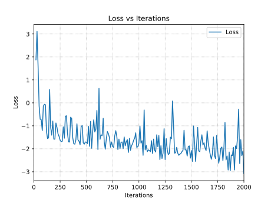

## Post-training diffusion-based Text2World models

### Model Support Matrix

We support the following Cosmos Diffusion models for post-training. Review the available models and their compute requirements for post-tuning and inference to determine the best model for your use case.

| Model Name                               | Model Status | Compute Requirements for Post-Training |
|----------------------------------------------|------------------|------------------------------------------|
| Cosmos-Predict1-7B-Text2World           | **Supported**    | 8 NVIDIA GPUs*                           |
| Cosmos-Predict1-14B-Text2World          | **Supported**    | 8 NVIDIA GPUs* x 4 nodes                 |

**\*** `H100-80GB` or `A100-80GB` GPUs are recommended.

### Environment setup

Please refer to the Post-training section of [INSTALL.md](/INSTALL.md#post-training) for instructions on environment setup.

### Download checkpoints

1. Generate a [Hugging Face](https://huggingface.co/settings/tokens) access token (if you haven't done so already). Set the access token to `Read` permission (default is `Fine-grained`).

2. Log in to Hugging Face with the access token:
   ```bash
   huggingface-cli login
   ```

3. Download the Cosmos model weights from [Hugging Face](https://huggingface.co/collections/nvidia/cosmos-predict1-67c9d1b97678dbf7669c89a7):
   ```bash
   CUDA_HOME=$CONDA_PREFIX PYTHONPATH=$(pwd) python scripts/download_diffusion_checkpoints.py --model_sizes 7B 14B --model_types Text2World
   ```

### Examples

Post-training a Cosmos Diffusion-based WFM enables you to train the model to generate videos that are more specific to your use case.

There are 3 steps to post-training: downloading a dataset, preprocessing the data, and post-training the model.

#### 1. Download a Dataset

The first step is to download a dataset with videos and captions.

You must provide a folder containing a collection of videos in **MP4 format**, preferably 720p. These videos should focus on the subject throughout the entire video so that each video chunk contains the subject.

You can use [nvidia/Cosmos-NeMo-Assets](https://huggingface.co/datasets/nvidia/Cosmos-NeMo-Assets) for post-training.

```bash
mkdir -p datasets/cosmos_nemo_assets/

# This command will download the videos for physical AI
huggingface-cli download nvidia/Cosmos-NeMo-Assets --repo-type dataset --local-dir datasets/cosmos_nemo_assets/ --include "*.mp4*"

mv datasets/cosmos_nemo_assets/nemo_diffusion_example_data datasets/cosmos_nemo_assets/videos
```

#### 2. Preprocessing the Data

Run the following command to pre-compute T5-XXL embeddings for the video captions used for post-training:

```bash
# The script will use the provided prompt, save the T5-XXL embeddings in pickle format.
CUDA_HOME=$CONDA_PREFIX PYTHONPATH=$(pwd) python scripts/get_t5_embeddings_from_cosmos_nemo_assets.py --dataset_path datasets/cosmos_nemo_assets --prompt "A video of sks teal robot."
```

Dataset folder format:
```
datasets/cosmos_nemo_assets/
├── metas/
│   ├── *.txt
├── videos/
│   ├── *.mp4
├── t5_xxl/
│   ├── *.pickle
```

#### 3. Post-train the Model

##### Cosmos-Predict1-7B-Text2World

Run the following command to execute an example post-training job with `cosmos_nemo_assets` data.
```bash
export OUTPUT_ROOT=checkpoints # default value
torchrun --nproc_per_node=8 -m cosmos_predict1.diffusion.training.train \
    --config=cosmos_predict1/diffusion/training/config/config.py \
    -- experiment=text2world_7b_example_cosmos_nemo_assets
```

Here's an example running log on a single node (8 x H100 GPUs).
```bash
[04-14 02:44:17|INFO|cosmos_predict1/utils/trainer.py:149:train] Starting training...
[04-14 02:51:09|INFO|cosmos_predict1/diffusion/training/callbacks/iter_speed.py:80:every_n_impl] 20 : iter_speed 19.06 seconds per iteration | Loss: 1.5156
[04-14 02:54:20|INFO|cosmos_predict1/diffusion/training/callbacks/iter_speed.py:80:every_n_impl] 30 : iter_speed 19.10 seconds per iteration | Loss: 1.8672
[04-14 02:57:31|INFO|cosmos_predict1/diffusion/training/callbacks/iter_speed.py:80:every_n_impl] 40 : iter_speed 19.10 seconds per iteration | Loss: 0.3652
[04-14 03:00:43|INFO|cosmos_predict1/diffusion/training/callbacks/iter_speed.py:80:every_n_impl] 50 : iter_speed 19.16 seconds per iteration | Loss: -1.2344
[04-14 03:03:54|INFO|cosmos_predict1/diffusion/training/callbacks/iter_speed.py:80:every_n_impl] 60 : iter_speed 19.14 seconds per iteration | Loss: -1.2656
[04-14 03:07:06|INFO|cosmos_predict1/diffusion/training/callbacks/iter_speed.py:80:every_n_impl] 70 : iter_speed 19.17 seconds per iteration | Loss: -1.1641
[04-14 03:10:18|INFO|cosmos_predict1/diffusion/training/callbacks/iter_speed.py:80:every_n_impl] 80 : iter_speed 19.18 seconds per iteration | Loss: -1.3750
[04-14 03:13:31|INFO|cosmos_predict1/diffusion/training/callbacks/iter_speed.py:80:every_n_impl] 90 : iter_speed 19.29 seconds per iteration | Loss: -0.6680
```

Example loss curve:  



Optionally, multi-node training can be done with
```bash
# 4-node training example.
torchrun --nproc_per_node=8 --nnodes=4 --rdzv_id 123 --rdzv_backend c10d --rdzv_endpoint $MASTER_ADDR:1234 \
    -m cosmos_predict1.diffusion.training.train \
    --config=cosmos_predict1/diffusion/training/config/config.py \
    -- experiment=text2world_7b_example_cosmos_nemo_assets
```

Here's an example running log on 4 nodes (8 x H100 GPUs x 4 nodes).
```bash
[04-03 09:54:04|INFO|cosmos_predict1/utils/trainer.py:144:train] Starting training...
[04-15 01:44:46|INFO|cosmos_predict1/diffusion/training/callbacks/iter_speed.py:80:every_n_impl] 20 : iter_speed 19.75 seconds per iteration | Loss: 1.4844
[04-15 01:48:04|INFO|cosmos_predict1/diffusion/training/callbacks/iter_speed.py:80:every_n_impl] 30 : iter_speed 19.79 seconds per iteration | Loss: 1.7891
[04-15 01:51:22|INFO|cosmos_predict1/diffusion/training/callbacks/iter_speed.py:80:every_n_impl] 40 : iter_speed 19.82 seconds per iteration | Loss: 0.9609
[04-15 01:54:40|INFO|cosmos_predict1/diffusion/training/callbacks/iter_speed.py:80:every_n_impl] 50 : iter_speed 19.83 seconds per iteration | Loss: -1.3281
[04-15 01:57:59|INFO|cosmos_predict1/diffusion/training/callbacks/iter_speed.py:80:every_n_impl] 60 : iter_speed 19.83 seconds per iteration | Loss: -1.1641
[04-15 02:01:17|INFO|cosmos_predict1/diffusion/training/callbacks/iter_speed.py:80:every_n_impl] 70 : iter_speed 19.88 seconds per iteration | Loss: -1.3281
[04-15 02:04:37|INFO|cosmos_predict1/diffusion/training/callbacks/iter_speed.py:80:every_n_impl] 80 : iter_speed 19.96 seconds per iteration | Loss: -1.2656
[04-15 02:07:57|INFO|cosmos_predict1/diffusion/training/callbacks/iter_speed.py:80:every_n_impl] 90 : iter_speed 19.98 seconds per iteration | Loss: -0.8008
```

The model will be post-trained using the above `cosmos_nemo_assets` dataset.
See the config `text2world_7b_example_cosmos_nemo_assets` defined in `cosmos_predict1/diffusion/training/config/text2world/experiment.py` to understand how the dataloader is determined.
```python
num_frames = 121
example_video_dataset_cosmos_nemo_assets = L(Dataset)(
    dataset_dir="datasets/cosmos_nemo_assets",
    sequence_interval=1,
    num_frames=num_frames,
    video_size=(720, 1280),
    start_frame_interval=1,
)

dataloader_train_cosmos_nemo_assets = L(DataLoader)(
    dataset=example_video_dataset_cosmos_nemo_assets,
    sampler=L(get_sampler)(dataset=example_video_dataset_cosmos_nemo_assets),
    batch_size=1,
    drop_last=True,
)
...

text2world_7b_example_cosmos_nemo_assets = LazyDict(
    dict(
        model=dict(
            latent_shape=[
                16,  # Latent channel dim
                16,  # Latent temporal dim
                88,  # Latent height dim, ~= 720/8
                160,  # Latent width dim, == 1280/8
            ],
        ),
        dataloader_train=dataloader_train_cosmos_nemo_assets,
        ...
    )
)
...
```

The checkpoints will be saved to `${OUTPUT_ROOT}/PROJECT/GROUP/NAME`.
In the above example, `PROJECT` is `posttraining`, `GROUP` is `diffusion_text2world`, `NAME` is `text2world_7b_example_cosmos_nemo_assets`.

See the job config to understand how they are determined.
```python
text2world_7b_example_cosmos_nemo_assets = LazyDict(
    dict(
        ...
        job=dict(
            project="posttraining",
            group="diffusion_text2world",
            name="text2world_7b_example_cosmos_nemo_assets",
        ),
        ...
    )
)
```

During the training, the checkpoints will be saved in the below structure.
```
checkpoints/posttraining/diffusion_text2world/text2world_7b_example_cosmos_nemo_assets/checkpoints/
├── iter_{NUMBER}_reg_model.pt
├── iter_{NUMBER}_ema_model.pt
```

##### Cosmos-Predict1-7B-Text2World with LoRA

Run the following command to execute an example LoRA post-training job with `cosmos_nemo_assets` data.
```bash
export OUTPUT_ROOT=checkpoints # default value
torchrun --nproc_per_node=4 -m cosmos_predict1.diffusion.training.train \
    --config=cosmos_predict1/diffusion/training/config/config.py \
    -- experiment=text2world_7b_lora_example_cosmos_nemo_assets
```
See the config `text2world_7b_lora_example_cosmos_nemo_assets` defined in `cosmos_predict1/diffusion/training/config/text2world/experiment.py` and `cosmos_predict1/diffusion/training/utils/layer_control/peft_control_config_parser.py` to understand how LoRA is enabled. 
```python
text2world_7b_example_cosmos_nemo_assets = LazyDict(
    dict(
        defaults=[
            ...
            {"override /ckpt_klass": "peft"},
            ...
        ],
        trainer=dict(
            ...
            distributed_parallelism="ddp",
            ...
        )
        model=dict(
            ...
            peft_control=get_fa_ca_qv_lora_config(first_nblocks=28, rank=8, scale=1),
            ...
        ),
    )
)
```

During the training, the checkpoints will be saved in the below structure.
```
checkpoints/posttraining/diffusion_text2world/text2world_7b_lora_example_cosmos_nemo_assets/checkpoints/
├── iter_{NUMBER}_model.pt
```

`iter_{NUMBER}_model.pt` contains all weights (base model weights and LoRA weights tensors). When `ema=True`, the checkpoint will contain both regular and ema weights.


##### Cosmos-Predict1-14B-Text2World

Run the following command to execute an example post-training job with `cosmos_nemo_assets` data.
```bash
export OUTPUT_ROOT=checkpoints # default value
torchrun --nproc_per_node=8 --nnodes=4 --rdzv_id 123 --rdzv_backend c10d --rdzv_endpoint $MASTER_ADDR:1234 \
    -m cosmos_predict1.diffusion.training.train \
    --config=cosmos_predict1/diffusion/training/config/config.py \
    -- experiment=text2world_14b_example_cosmos_nemo_assets
```

During the training, the checkpoints will be saved in the below structure.
```
checkpoints/posttraining/diffusion_text2world/text2world_14b_example_cosmos_nemo_assets/checkpoints/
├── iter_{NUMBER}_reg_model.pt
├── iter_{NUMBER}_ema_model.pt
```

#### 4. Inference with the Post-trained Model Checkpoint

The inference can be done with the same interface as described in [examples/inference_diffusion_text2world.md](inference_diffusion_text2world.md).

##### Cosmos-Predict1-7B-Text2World

1. Copying checkpoint to the designated location

The post-trained checkpoint needs to be copied to `checkpoints/Cosmos-Predict1-7B-Text2World_post-trained/model.pt`

For example, if a post-trained checkpoint (ema) with 2000 iterations is to be used,
```bash
# copy checkpoint to the designated location
mkdir checkpoints/Cosmos-Predict1-7B-Text2World_post-trained/
cp checkpoints/posttraining/diffusion_text2world/text2world_7b_example_cosmos_nemo_assets/checkpoints/iter_000002000_ema_model.pt checkpoints/Cosmos-Predict1-7B-Text2World_post-trained/model.pt
```

2. Running the inference

We will set the prompt with an environment variable first.
```bash
PROMPT="A sleek, humanoid robot stands in a vast warehouse filled with neatly stacked cardboard boxes on industrial shelves. \
The robot's metallic body gleams under the bright, even lighting, highlighting its futuristic design and intricate joints. \
A glowing blue light emanates from its chest, adding a touch of advanced technology. The background is dominated by rows of boxes, \
suggesting a highly organized storage system. The floor is lined with wooden pallets, enhancing the industrial setting. \
The camera remains static, capturing the robot's poised stance amidst the orderly environment, with a shallow depth of \
field that keeps the focus on the robot while subtly blurring the background for a cinematic effect."
```

```bash
# Run the video generation command with a single gpu
CUDA_HOME=$CONDA_PREFIX PYTHONPATH=$(pwd) python cosmos_predict1/diffusion/inference/text2world.py \
    --checkpoint_dir checkpoints \
    --diffusion_transformer_dir Cosmos-Predict1-7B-Text2World_post-trained \
    --prompt "${PROMPT}" \
    --offload_prompt_upsampler \
    --video_save_name diffusion-text2world-7b-post-trained
```

The output file is located at `outputs/diffusion-text2world-7b-post-trained.mp4`.


##### Cosmos-Predict1-7B-Text2World with LoRA

1. Copying checkpoint to the designated location.

The LoRA post-trained checkpoint needs to be copied to `checkpoints/Cosmos-Predict1-7B-Text2World_post-trained-lora/model.pt`

For example, if a LoRA post-trained checkpoint with 5000 iterations is to be used,
```bash
# copy checkpoint to the designated location
mkdir checkpoints/Cosmos-Predict1-7B-Text2World_post-trained-lora/
cp checkpoints/posttraining/diffusion_text2world/text2world_7b_lora_example_cosmos_nemo_assets/checkpoints/iter_000005000_model.pt checkpoints/Cosmos-Predict1-7B-Text2World_post-trained-lora/model.pt
```

2. Running the inference

We will set the example prompt (used for all videos in example dataset) as input and run the inference command with disabled prompt upsampler.
```bash
PROMPT="A video of sks teal robot."
```

```bash
# Run the video generation command
NUM_GPUS=4
CUDA_HOME=$CONDA_PREFIX PYTHONPATH=$(pwd) torchrun --nproc_per_node=${NUM_GPUS} cosmos_predict1/diffusion/inference/text2world.py \
    --num_gpus ${NUM_GPUS} \
    --checkpoint_dir checkpoints \
    --diffusion_transformer_dir Cosmos-Predict1-7B-Text2World_post-trained-lora \
    --prompt "${PROMPT}" \
    --disable_prompt_upsampler \
    --video_save_name diffusion-text2world-7b-post-trained-lora
```

The output file is located at `outputs/diffusion-text2world-7b-post-trained-lora.mp4`.


##### Cosmos-Predict1-14B-Text2World

1. Copying checkpoint to the designated location

The post-trained checkpoint needs to be copied to `checkpoints/Cosmos-Predict1-14B-Text2World_post-trained/model.pt`

For example, if a post-trained checkpoint (ema) with 2000 iterations is to be used,
```bash
# copy checkpoint to the designated location
mkdir checkpoints/Cosmos-Predict1-14B-Text2World_post-trained/
cp checkpoints/posttraining/diffusion_text2world/text2world_14b_example_cosmos_nemo_assets/checkpoints/iter_000002000_ema_model.pt checkpoints/Cosmos-Predict1-14B-Text2World_post-trained/model.pt
```

2. Running the inference

We will set the prompt with an environment variable first.
```bash
PROMPT="A sleek, humanoid robot stands in a vast warehouse filled with neatly stacked cardboard boxes on industrial shelves. \
The robot's metallic body gleams under the bright, even lighting, highlighting its futuristic design and intricate joints. \
A glowing blue light emanates from its chest, adding a touch of advanced technology. The background is dominated by rows of boxes, \
suggesting a highly organized storage system. The floor is lined with wooden pallets, enhancing the industrial setting. \
The camera remains static, capturing the robot's poised stance amidst the orderly environment, with a shallow depth of \
field that keeps the focus on the robot while subtly blurring the background for a cinematic effect."
```

```bash
# Run the video generation command with a single GPU
CUDA_HOME=$CONDA_PREFIX PYTHONPATH=$(pwd) python cosmos_predict1/diffusion/inference/text2world.py \
    --diffusion_transformer_dir Cosmos-Predict1-14B-Text2World_post-trained \
    --prompt "${PROMPT}" \
    --offload_tokenizer \
    --offload_diffusion_transformer \
    --offload_text_encoder_model \
    --offload_prompt_upsampler \
    --offload_guardrail_models \
    --video_save_name diffusion-text2world-14b-post-trained
```

The output file is located at `outputs/diffusion-text2world-14b-post-trained.mp4`.
